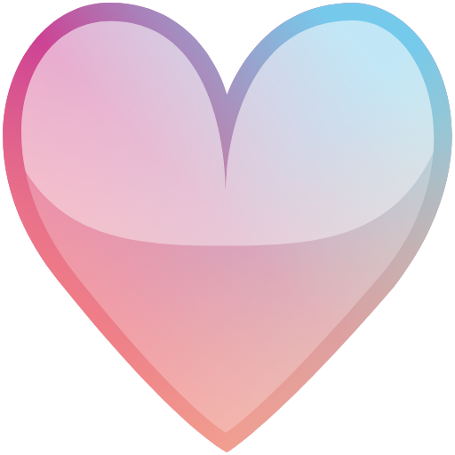

# Vonage Heart

It all started with the beautiful rainbow heart emoji I made in Photoshop, that used the Vonage brand guidelines "gradient" as background colour. It was so pretty, it became popular on our own Slack and then used by our community team on other platforms, like the Hacktoberfest Discord.

Now, it has been re-created as SVG to be remixed into other pretty hearts.

## All the hearts

| Name | 52px | SVG | PNG | Contributor |
|---|:-:|---|---|---|
| Vonage Heart |  | [SVG](src/vonage_heart.svg) | [PNG](build/vonage_heart_512.png) | [@lukeocodes](https://github.com/lukeocodes) |
| Pride Heart |  | [SVG](src/pride_heart.svg) | [PNG](build/pride_heart_512.png) | [@lukeocodes](https://github.com/lukeocodes) |
| Digital Ocean Heart |  | [SVG](src/do_heart.svg) | [PNG](build/do_heart_512.png) | [@lukeocodes](https://github.com/lukeocodes) |
| Hacktoberfest 2020 Heart |  | [SVG](src/hf_heart_2020.svg) | [PNG](build/hf_heart_2020_512.png) | [@lukeocodes](https://github.com/lukeocodes) |

## Contributing

- Fork this repository (STAR IT TOO!).
- Create your own heart SVG in the `src` directory. 
- Run `npm install` (first time only).
- Run `npm run build`.
- Add your heart to the table.

## Why?

Because, open source  at its finest.

## License

The contents of this project are licensed under the [MIT license](LICENSE).
