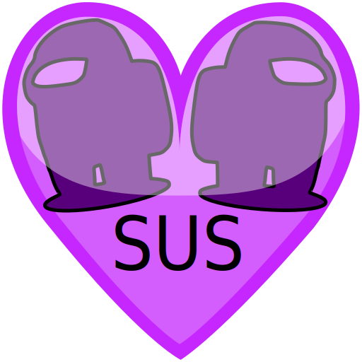
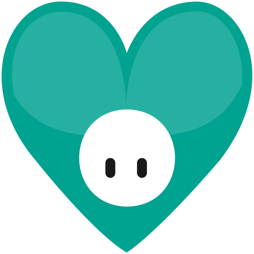
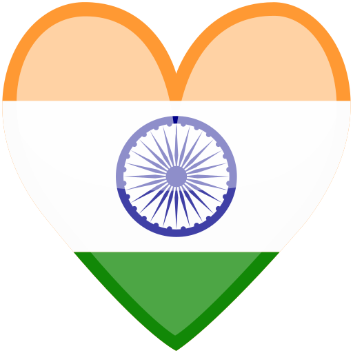

# Dev Hearts

It all started with the beautiful rainbow "Vonage" heart emoji I made in Photoshop, that used the Vonage brand guidelines "gradient" as background colour. It was so pretty, it became popular on the Vonage internal Slack and then used by the Vonage community team on other platforms, like the Hacktoberfest Discord.

Now, it has been re-created as SVG to be remixed into other pretty hearts.

## All the hearts

<!-- START TABLE -->
| Name                 |           Code           |                                        SVG                                         |                                                                                                                                                                   PNGs                                                                                                                                                                    |
| :------------------- | :----------------------: | :--------------------------------------------------------------------------------: | :---------------------------------------------------------------------------------------------------------------------------------------------------------------------------------------------------------------------------------------------------------------------------------------------------------------------------------------: |
| Among Us             |       : among_us :       |                          |                                           [16px](./build/among_us@0.0625x.png), [32px](./build/among_us@0.125x.png), [64px](./build/among_us@0.25x.png), [128px](./build/among_us@0.5x.png), [256px](./build/among_us.png), [512px](./build/among_us@2x.png), [1024px](./build/among_us@4x.png)                                           |
| Black Heart          |     : black_heart :      |                    |                                [16px](./build/black_heart@0.0625x.png), [32px](./build/black_heart@0.125x.png), [64px](./build/black_heart@0.25x.png), [128px](./build/black_heart@0.5x.png), [256px](./build/black_heart.png), [512px](./build/black_heart@2x.png), [1024px](./build/black_heart@4x.png)                                 |
| Blue Heart           |      : blue_heart :      |                      |                                    [16px](./build/blue_heart@0.0625x.png), [32px](./build/blue_heart@0.125x.png), [64px](./build/blue_heart@0.25x.png), [128px](./build/blue_heart@0.5x.png), [256px](./build/blue_heart.png), [512px](./build/blue_heart@2x.png), [1024px](./build/blue_heart@4x.png)                                    |
| Canada Heart         |     : canada_heart :     |                  |                             [16px](./build/canada_heart@0.0625x.png), [32px](./build/canada_heart@0.125x.png), [64px](./build/canada_heart@0.25x.png), [128px](./build/canada_heart@0.5x.png), [256px](./build/canada_heart.png), [512px](./build/canada_heart@2x.png), [1024px](./build/canada_heart@4x.png)                             |
| Deepgram Heart       |    : deepgram_heart :    |              |                      [16px](./build/deepgram_heart@0.0625x.png), [32px](./build/deepgram_heart@0.125x.png), [64px](./build/deepgram_heart@0.25x.png), [128px](./build/deepgram_heart@0.5x.png), [256px](./build/deepgram_heart.png), [512px](./build/deepgram_heart@2x.png), [1024px](./build/deepgram_heart@4x.png)                      |
| Digital Ocean Heart  | : digital_ocean_heart :  |    |    [16px](./build/digital_ocean_heart@0.0625x.png), [32px](./build/digital_ocean_heart@0.125x.png), [64px](./build/digital_ocean_heart@0.25x.png), [128px](./build/digital_ocean_heart@0.5x.png), [256px](./build/digital_ocean_heart.png), [512px](./build/digital_ocean_heart@2x.png), [1024px](./build/digital_ocean_heart@4x.png)     |
| England Heart        |    : england_heart :     |                |                         [16px](./build/england_heart@0.0625x.png), [32px](./build/england_heart@0.125x.png), [64px](./build/england_heart@0.25x.png), [128px](./build/england_heart@0.5x.png), [256px](./build/england_heart.png), [512px](./build/england_heart@2x.png), [1024px](./build/england_heart@4x.png)                          |
| European Union Heart | : european_union_heart : |  | [16px](./build/european_union_heart@0.0625x.png), [32px](./build/european_union_heart@0.125x.png), [64px](./build/european_union_heart@0.25x.png), [128px](./build/european_union_heart@0.5x.png), [256px](./build/european_union_heart.png), [512px](./build/european_union_heart@2x.png), [1024px](./build/european_union_heart@4x.png) |
| Fall Guys Heart      |   : fall_guys_heart :    |            |                  [16px](./build/fall_guys_heart@0.0625x.png), [32px](./build/fall_guys_heart@0.125x.png), [64px](./build/fall_guys_heart@0.25x.png), [128px](./build/fall_guys_heart@0.5x.png), [256px](./build/fall_guys_heart.png), [512px](./build/fall_guys_heart@2x.png), [1024px](./build/fall_guys_heart@4x.png)                   |
| Green Heart          |     : green_heart :      |                    |                                [16px](./build/green_heart@0.0625x.png), [32px](./build/green_heart@0.125x.png), [64px](./build/green_heart@0.25x.png), [128px](./build/green_heart@0.5x.png), [256px](./build/green_heart.png), [512px](./build/green_heart@2x.png), [1024px](./build/green_heart@4x.png)                                 |
| Hf Heart 2020        |    : hf_heart_2020 :     |                |                         [16px](./build/hf_heart_2020@0.0625x.png), [32px](./build/hf_heart_2020@0.125x.png), [64px](./build/hf_heart_2020@0.25x.png), [128px](./build/hf_heart_2020@0.5x.png), [256px](./build/hf_heart_2020.png), [512px](./build/hf_heart_2020@2x.png), [1024px](./build/hf_heart_2020@4x.png)                          |
| Hf Heart 2021        |    : hf_heart_2021 :     |                |                         [16px](./build/hf_heart_2021@0.0625x.png), [32px](./build/hf_heart_2021@0.125x.png), [64px](./build/hf_heart_2021@0.25x.png), [128px](./build/hf_heart_2021@0.5x.png), [256px](./build/hf_heart_2021.png), [512px](./build/hf_heart_2021@2x.png), [1024px](./build/hf_heart_2021@4x.png)                          |
| India Heart          |     : india_heart :      |                    |                                [16px](./build/india_heart@0.0625x.png), [32px](./build/india_heart@0.125x.png), [64px](./build/india_heart@0.25x.png), [128px](./build/india_heart@0.5x.png), [256px](./build/india_heart.png), [512px](./build/india_heart@2x.png), [1024px](./build/india_heart@4x.png)                                 |
| Orange Heart         |     : orange_heart :     |                  |                             [16px](./build/orange_heart@0.0625x.png), [32px](./build/orange_heart@0.125x.png), [64px](./build/orange_heart@0.25x.png), [128px](./build/orange_heart@0.5x.png), [256px](./build/orange_heart.png), [512px](./build/orange_heart@2x.png), [1024px](./build/orange_heart@4x.png)                             |
| Pixel Heart          |     : pixel_heart :      |                    |                                [16px](./build/pixel_heart@0.0625x.png), [32px](./build/pixel_heart@0.125x.png), [64px](./build/pixel_heart@0.25x.png), [128px](./build/pixel_heart@0.5x.png), [256px](./build/pixel_heart.png), [512px](./build/pixel_heart@2x.png), [1024px](./build/pixel_heart@4x.png)                                 |
| Pride Heart          |     : pride_heart :      |                    |                                [16px](./build/pride_heart@0.0625x.png), [32px](./build/pride_heart@0.125x.png), [64px](./build/pride_heart@0.25x.png), [128px](./build/pride_heart@0.5x.png), [256px](./build/pride_heart.png), [512px](./build/pride_heart@2x.png), [1024px](./build/pride_heart@4x.png)                                 |
| Purple Heart         |     : purple_heart :     |                  |                             [16px](./build/purple_heart@0.0625x.png), [32px](./build/purple_heart@0.125x.png), [64px](./build/purple_heart@0.25x.png), [128px](./build/purple_heart@0.5x.png), [256px](./build/purple_heart.png), [512px](./build/purple_heart@2x.png), [1024px](./build/purple_heart@4x.png)                             |
| Red Heart            |      : red_heart :       |                        |                                       [16px](./build/red_heart@0.0625x.png), [32px](./build/red_heart@0.125x.png), [64px](./build/red_heart@0.25x.png), [128px](./build/red_heart@0.5x.png), [256px](./build/red_heart.png), [512px](./build/red_heart@2x.png), [1024px](./build/red_heart@4x.png)                                        |
| Scotland Heart       |    : scotland_heart :    |              |                      [16px](./build/scotland_heart@0.0625x.png), [32px](./build/scotland_heart@0.125x.png), [64px](./build/scotland_heart@0.25x.png), [128px](./build/scotland_heart@0.5x.png), [256px](./build/scotland_heart.png), [512px](./build/scotland_heart@2x.png), [1024px](./build/scotland_heart@4x.png)                      |
| Trans Pride Flag     |   : trans_pride_flag :   |          |               [16px](./build/trans_pride_flag@0.0625x.png), [32px](./build/trans_pride_flag@0.125x.png), [64px](./build/trans_pride_flag@0.25x.png), [128px](./build/trans_pride_flag@0.5x.png), [256px](./build/trans_pride_flag.png), [512px](./build/trans_pride_flag@2x.png), [1024px](./build/trans_pride_flag@4x.png)               |
| Uk Heart             |       : uk_heart :       |                          |                                           [16px](./build/uk_heart@0.0625x.png), [32px](./build/uk_heart@0.125x.png), [64px](./build/uk_heart@0.25x.png), [128px](./build/uk_heart@0.5x.png), [256px](./build/uk_heart.png), [512px](./build/uk_heart@2x.png), [1024px](./build/uk_heart@4x.png)                                           |
| Usa Heart            |      : usa_heart :       |                        |                                       [16px](./build/usa_heart@0.0625x.png), [32px](./build/usa_heart@0.125x.png), [64px](./build/usa_heart@0.25x.png), [128px](./build/usa_heart@0.5x.png), [256px](./build/usa_heart.png), [512px](./build/usa_heart@2x.png), [1024px](./build/usa_heart@4x.png)                                        |
| Vonage Heart         |     : vonage_heart :     |                  |                             [16px](./build/vonage_heart@0.0625x.png), [32px](./build/vonage_heart@0.125x.png), [64px](./build/vonage_heart@0.25x.png), [128px](./build/vonage_heart@0.5x.png), [256px](./build/vonage_heart.png), [512px](./build/vonage_heart@2x.png), [1024px](./build/vonage_heart@4x.png)                             |
| Wales Heart          |     : wales_heart :      |                    |                                [16px](./build/wales_heart@0.0625x.png), [32px](./build/wales_heart@0.125x.png), [64px](./build/wales_heart@0.25x.png), [128px](./build/wales_heart@0.5x.png), [256px](./build/wales_heart.png), [512px](./build/wales_heart@2x.png), [1024px](./build/wales_heart@4x.png)                                 |
| White Heart          |     : white_heart :      |                    |                                [16px](./build/white_heart@0.0625x.png), [32px](./build/white_heart@0.125x.png), [64px](./build/white_heart@0.25x.png), [128px](./build/white_heart@0.5x.png), [256px](./build/white_heart.png), [512px](./build/white_heart@2x.png), [1024px](./build/white_heart@4x.png)                                 |
| Yellow Heart         |     : yellow_heart :     |                  |                             [16px](./build/yellow_heart@0.0625x.png), [32px](./build/yellow_heart@0.125x.png), [64px](./build/yellow_heart@0.25x.png), [128px](./build/yellow_heart@0.5x.png), [256px](./build/yellow_heart.png), [512px](./build/yellow_heart@2x.png), [1024px](./build/yellow_heart@4x.png)                             |

<!-- END TABLE -->

## Contributing

- Fork this repository, then clone it to your machine.
- Create your own heart SVG in the `src` directory. 
- Run `npm install` (first time only).
- Run `npm run build` to generate the PNG versions and update the README
- Commit changes.
- Push!

## Why?

Because, open source  at its finest. And, good heart emojis are hard.

## License

The contents of this project are licensed under the [MIT license](LICENSE).
